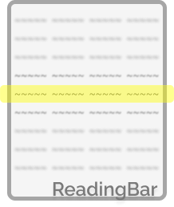
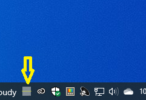
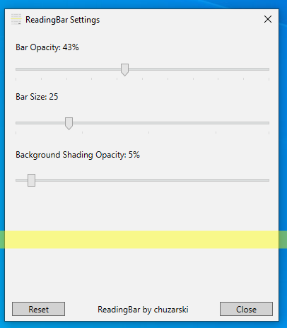

# Reading Bar

ReadingBar is a Windows utility that aids with reading text or wide spreadsheets. It allows you to read with a bar, like you would read a book using a bookmark!

## Features:
- Change bar size and opacity
- Shade the background and set shading opacity

# Usage:
- After starting the application, double click the systray icon to toggle the overlay

- Additionally, you can right click the icon and toggle
- You can adjust bar size and opacity in the settings menu!

